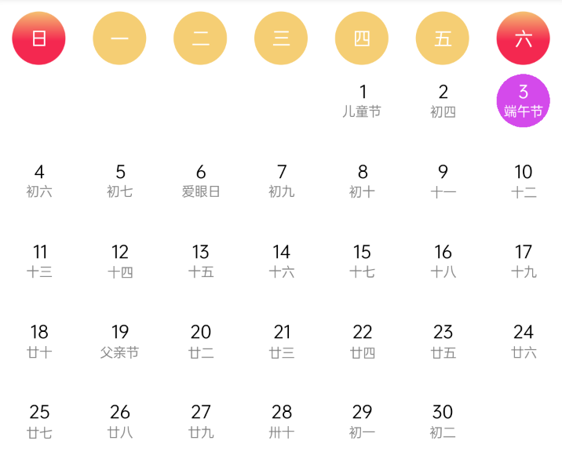

# SolarLunarView
公历农历 - 日历View  
1.显示中国节假日  
2.公历  
3.农历  
# 预览

# 资源
|名字|资源|
|-|-|
|AAR|[solar_lunar_view.aar](https://github.com/RelinRan/SolarLunarView/blob/main/solar_lunar_view.aar)|
|Gitee|[SolarLunarView](https://gitee.com/relin/SolarLunarView)|
|GitHub |[SolarLunarView](https://github.com/RelinRan/SolarLunarView)|
# Maven
1.build.grade | setting.grade
```
repositories {
	...
	maven { url 'https://jitpack.io' }
}
```
2./app/build.grade
```
dependencies {
	implementation 'com.github.RelinRan:SolarLunarView:2022.6.9.1'
}
```
# xml
```
<com.androidx.widget.SolarLunarView
    android:layout_width="match_parent"
    android:background="@android:color/white"
    android:layout_height="350dp"/>
```
# attr.xml
```
<attr name="solarYear" format="integer" />
<attr name="solarMonth" format="integer" />
<attr name="solarDay" format="integer" />
<attr name="dayRadius" format="dimension|float" />
<attr name="solarTextSize" format="dimension|float|reference" />
<attr name="solarTextColor" format="color|reference" />
<attr name="lunarTextSize" format="dimension|float|reference" />
<attr name="lunarTextColor" format="color|reference" />
<attr name="LunarMarginTop" format="dimension|reference" />
<attr name="titleTextSize" format="dimension|reference" />
<attr name="titleMarginTop" format="dimension|reference" />
<attr name="titleMarginBottom" format="dimension|reference" />
<attr name="selectBackgroundColor" format="color|reference" />
<attr name="selectSolarTextColor" format="color|reference" />
<attr name="selectLunarTextColor" format="color|reference" />
<attr name="titleTextColor" format="color|reference" />
<attr name="gradientStartColor" format="color|reference" />
<attr name="gradientEndColor" format="color|reference" />
<attr name="titleBackgroundColor" format="color|reference" />
```
# 使用
```
SolarLunarView solar_lunar = findViewById(R.id.solar_lunar);
solar_lunar.setYear(2022);
solar_lunar.setMonth(6);
solar_lunar.setDay(5);
solar_lunar.setOnItemClickListener(new SolarLunarView.OnItemClickListener() {
    @Override
    public void onItemClickListener(SolarLunarView view, Date time) {
        SimpleDateFormat format = new SimpleDateFormat("yyyy-MM-dd");
        String date = format.format(time);
    }
});
```
